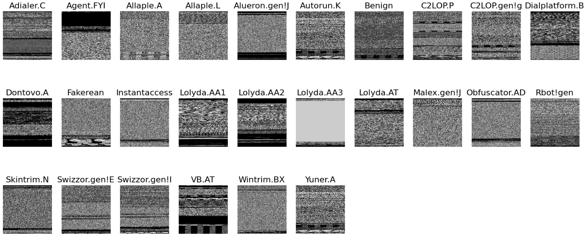
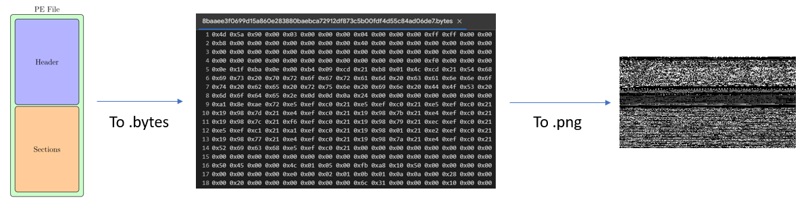
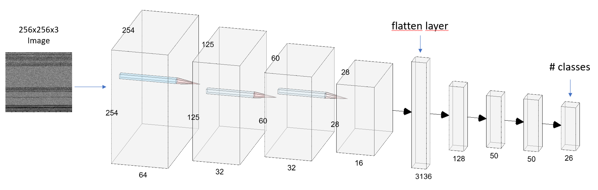

# Malware Classification using Convolutional Neural Networks (CNNs)
This GitHub repository contains an implementation of a malware classification system using Convolutional Neural Networks (CNNs). The goal of this project is to develop a model capable of accurately classifying different types of malware based on their input executable as an image.

First implementation `malimg_classifier` trained on 25 malware classes from Malimg dataset.

A second implementation `combined_classifier` includes in the dataset a benign class extracted from PE legitimate samples in [DikeDataset](https://github.com/iosifache/DikeDataset/tree/main).

The full explanation of the experiments can be found in `presentation.pdf`.

## Introduction
Malware (malicious software) poses a significant threat to computer systems and networks worldwide. It is crucial to detect and classify malware accurately to prevent potential security breaches. This project focuses on leveraging the power of CNNs, a deep learning technique commonly used in computer vision tasks, to classify malware samples into different categories.

## Dataset
The dataset Malimg used for this project contains labeled samples of different types of malware. Each sample is stored in a separate directory, with the directory name indicating the malware class. 

A benign subset is stored in another folder which is uploaded in `benign_data`, while the Malimg dataset can be found [here](https://paperswithcode.com/dataset/malimg).

The dataset is organized in the following structure:

```
malimg_dataset/
├── class1/
│ ├── malware1.png
│ ├── malware2.png
│ ├── ...
├── class2/
│ ├── malware3.png
│ ├── malware4.png
│ ├── ...
├── ...
benign_data/
├── benign_imgs/
│ ├── sample1.png
│ ├── sample2.png
│ ├── ...
```

### Dataset samples for each class


### Benign data conversion


You can find the full code in `utils/data_conversion.ipynb`. Integrated from [here](https://github.com/danielkrupinski/PE2HEX) and [here](https://github.com/hugom1997/Malware_Classification).


## Model Architecture
The CNN model architecture used in this project consists of several convolutional layers, followed by pooling layers and fully connected layers. The CNN workflow is the following:



## Final Training


### Confusion matrix on combined classifier


### Evaluation metrics on combined classifier
<table>
  <thead>
    <tr>
      <th>Overall</th>
      <th>precision</th>
      <th>recall</th>
      <th>f1-score</th>
      <th>support</th>
    </tr>
  </thead>
  <tbody>
    <tr>
      <td>accuracy</td>
      <td>0.8666</td>
      <td>0.8666</td>
      <td>0.8666</td>
      <td>0.8666</td>
    </tr>
    <tr>
      <td>macro avg</td>
      <td>0.81705</td>
      <td>0.88241</td>
      <td>0.83163</td>
      <td>2054.0</td>
    </tr>
    <tr>
      <td>weighted avg</td>
      <td>0.86608</td>
      <td>0.8666</td>
      <td>0.85959</td>
      <td>2054.0</td>
    </tr>
  </tbody>
</table>


### Evaluation metrics for each class on combined classifier
 <table>
    <tr>
        <td>class</td>
        <td>precision</td>
        <td>recall</td>
        <td>f1-score</td>
        <td>support</td>
    </tr>
    <tr>
        <td>Adialer.C</td>
        <td>0.96</td>
        <td>1.0</td>
        <td>0.97959</td>
        <td>24.0</td>
    </tr>
    <tr>
        <td>Agent.FYI</td>
        <td>0.95833</td>
        <td>1.0</td>
        <td>0.97872</td>
        <td>23.0</td>
    </tr>
    <tr>
        <td>Allaple.A</td>
        <td>0.99313</td>
        <td>0.98132</td>
        <td>0.98719</td>
        <td>589.0</td>
    </tr>
    <tr>
        <td>Allaple.L</td>
        <td>1.0</td>
        <td>0.99686</td>
        <td>0.99843</td>
        <td>318.0</td>
    </tr>
    <tr>
        <td>Alueron.gen!J</td>
        <td>0.975</td>
        <td>1.0</td>
        <td>0.98734</td>
        <td>39.0</td>
    </tr>
    <tr>
        <td>Autorun.K</td>
        <td>0.11602</td>
        <td>1.0</td>
        <td>0.20792</td>
        <td>21.0</td>
    </tr>
    <tr>
        <td>Benign</td>
        <td>0.98658</td>
        <td>0.75</td>
        <td>0.85217</td>
        <td>196.0</td>
    </tr>
    <tr>
        <td>C2LOP.P</td>
        <td>0.39216</td>
        <td>0.68966</td>
        <td>0.5</td>
        <td>29.0</td>
    </tr>
    <tr>
        <td>C2LOP.gen!g</td>
        <td>0.63158</td>
        <td>0.9</td>
        <td>0.74227</td>
        <td>40.0</td>
    </tr>
    <tr>
        <td>Dialplatform.B</td>
        <td>1.0</td>
        <td>0.97143</td>
        <td>0.98551</td>
        <td>35.0</td>
    </tr>
    <tr>
        <td>Dontovo.A</td>
        <td>0.94118</td>
        <td>1.0</td>
        <td>0.9697</td>
        <td>32.0</td>
    </tr>
    <tr>
        <td>Fakerean</td>
        <td>0.98611</td>
        <td>0.93421</td>
        <td>0.95946</td>
        <td>76.0</td>
    </tr>
    <tr>
        <td>Instantaccess</td>
        <td>0.97727</td>
        <td>1.0</td>
        <td>0.98851</td>
        <td>86.0</td>
    </tr>
    <tr>
        <td>Lolyda.AA1</td>
        <td>0.93333</td>
        <td>1.0</td>
        <td>0.96552</td>
        <td>42.0</td>
    </tr>
    <tr>
        <td>Lolyda.AA2</td>
        <td>0.91892</td>
        <td>0.94444</td>
        <td>0.93151</td>
        <td>36.0</td>
    </tr>
    <tr>
        <td>Lolyda.AA3</td>
        <td>0.88462</td>
        <td>0.95833</td>
        <td>0.92</td>
        <td>24.0</td>
    </tr>
    <tr>
        <td>Lolyda.AT</td>
        <td>0.9375</td>
        <td>0.96774</td>
        <td>0.95238</td>
        <td>31.0</td>
    </tr>
    <tr>
        <td>Malex.gen!J</td>
        <td>0.96154</td>
        <td>0.92593</td>
        <td>0.9434</td>
        <td>27.0</td>
    </tr>
    <tr>
        <td>Obfuscator.AD</td>
        <td>1.0</td>
        <td>1.0</td>
        <td>1.0</td>
        <td>28.0</td>
    </tr>
    <tr>
        <td>Rbot!gen</td>
        <td>0.88571</td>
        <td>1.0</td>
        <td>0.93939</td>
        <td>31.0</td>
    </tr>
    <tr>
        <td>Skintrim.N</td>
        <td>0.94118</td>
        <td>1.0</td>
        <td>0.9697</td>
        <td>16.0</td>
    </tr>
    <tr>
        <td>Swizzor.gen!E</td>
        <td>0.60714</td>
        <td>0.68</td>
        <td>0.64151</td>
        <td>25.0</td>
    </tr>
    <tr>
        <td>Swizzor.gen!I</td>
        <td>0.5</td>
        <td>0.30769</td>
        <td>0.38095</td>
        <td>26.0</td>
    </tr>
    <tr>
        <td>VB.AT</td>
        <td>0.89888</td>
        <td>0.98765</td>
        <td>0.94118</td>
        <td>81.0</td>
    </tr>
    <tr>
        <td>Wintrim.BX</td>
        <td>0.85714</td>
        <td>0.94737</td>
        <td>0.9</td>
        <td>19.0</td>
    </tr>
    <tr>
        <td>Yuner.A</td>
        <td>0.0</td>
        <td>0.0</td>
        <td>0.0</td>
        <td>160.0</td>
    </tr>
</table> 


# References

Gibert, D., Mateu, C., Planes, J. et al. Using convolutional neural networks for classification of malware represented as images. [Using convolutional neural networks for classification of malware represented as images](https://link.springer.com/article/10.1007/s11416-018-0323-0)

Daniel Gibert, Carles Mateu, Jordi Planes, Journal of Network and Computer Applications, The rise of machine learning for detection and classification of malware: Research developments, trends and challenges. [The rise of machine learning for detection and ... – ScienceDirect.](https://www.sciencedirect.com/science/article/pii/S1084804519303868)

Songqing Yue, Tianyang Wang, Imbalanced Malware Images Classification: a CNN based Approach. Imbalanced Malware Images Classification: a CNN based Approach. [ Imbalanced Malware Images Classification: a CNN based Approach](https://arxiv.org/abs/1708.08042)

Nataraj, Lakshmanan & Karthikeyan, Shanmugavadivel & Jacob, Grégoire & Manjunath, B.. (2011). Malware Images: Visualization and Automatic Classification. 10.1145/2016904.2016908. [Malware Images: Visualization and Automatic Classification – ResearchGate.](https://www.researchgate.net/publication/228811247_Malware_Images_Visualization_and_Automatic_Classification)

M. Kalash, M. Rochan, N. Mohammed, N. D. B. Bruce, Y. Wang and F. Iqbal, "Malware Classification with Deep Convolutional Neural Networks," 2018 9th IFIP International Conference on New Technologies, Mobility and Security (NTMS), Paris, France, 2018, pp. 1-5, doi: 10.1109/NTMS.2018.8328749.[ Malware Classification with Deep Convolutional Neural Networks | IEEE ...](https://ieeexplore.ieee.org/document/8328749)

Tuan, Anh Pham; Phuong, An Tran Hung; Thanh, Nguyen Vu; Van, Toan Nguyen (2018). Malware Detection PE-Based Analysis Using Deep Learning Algorithm Dataset. figshare. Dataset. [Malware Detection PE-Based Analysis Using Deep Learning Algorithm Dataset](https://figshare.com/articles/dataset/Malware_Detection_PE-Based_Analysis_Using_Deep_Learning_Algorithm_Dataset/6635642/1)https://figshare.com/articles/dataset/Malware_Detection_PE-Based_Analysis_Using_Deep_Learning_Algorithm_Dataset/6635642/1


